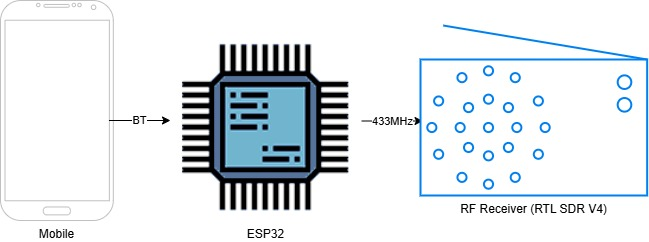
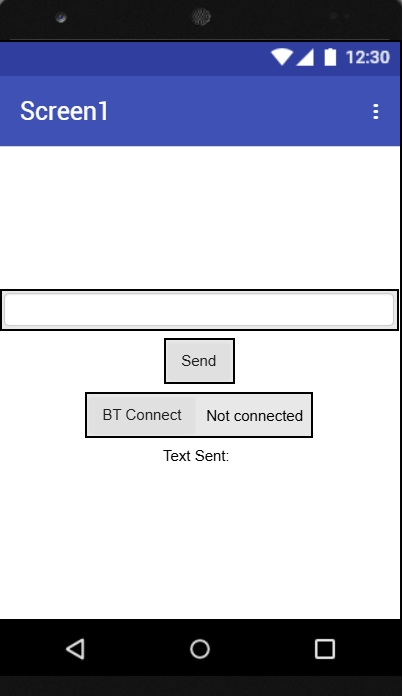
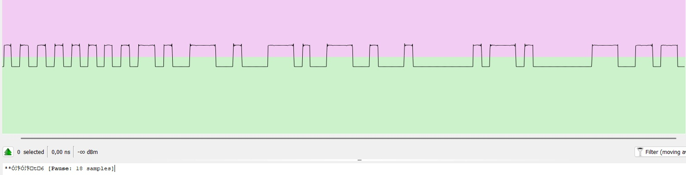

# ESP32-Based 433 MHz Radio Transmitter for Binary-to-Text Communication

The main goal of this project is to enable wireless transmission of text messages from a mobile phone using a 433 MHz radio frequency. An ESP32 microcontroller is used as the core of the system, acting as a bridge between the mobile device and the RF transmitter module. Text entered on the mobile phone is received by the ESP32, converted into a binary format, and then transmitted (ASK-OOK) over 433 MHz RF transmitter.

# Schematic diagram

  

# Components

- ESP32 with Bluetooth (ESP32 WROOM 32D)
- CC1101 based RF Transceiver (433 MHz)
- 433 MHz RF receiver (RTL SDR V4)

# Dependencies

Coding language:
- C++
- Python

IDE:

- Visual Studio Code
- PlatformIO
- Pycharm Community
- MIT App Inventor 

Libraries:
- ELECHOUSE_CC1101
- BluetoothSerial
- Arduino

# Screenshots

Mobile app interface:

  

  Signal presenting "t" char decoded with Universal Radio Hacker:

  

